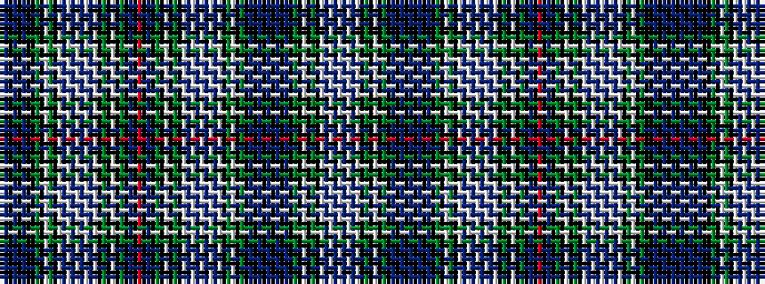

KBKBKBKKGKWGKWBWBWBWBWKGKWKGKBKRKBKGKWKGKWBWBWBWBWKGWKGKBKBKBKBKBKGKWKGKWBWBW

It is a 77 stripe tartan.

<figure class="pat-woven">

<figcaption>idealised sample</figcaption>
</figure>

## Colour Sequence



## Tartans with this colour sequence

| Tartans |
|---------------|
| [Kilbarchan Unidentified No. 14](/variants/s77/w3b2w14b3w3k5g12k1w3k1g12k12b2k2b2k2b12k2b2k2b2k12g12k1w3g12k5w3b3w14b2w3b2w14b3w3k5g12k1w3k1g12k12b12k1r3k1b12k12g12k1w3k1g12k5w3b3w14b2w3b2w14b3w3k5g12w3k1g12k12k2b2k2b12k2b2k2~x2/)|
||
