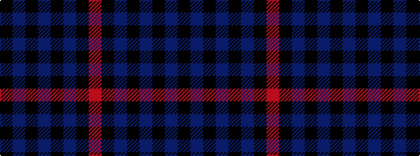

KBKBKBKR

It is a 8 stripe tartan.

<figure class="pat-woven">

<figcaption>idealised sample</figcaption>
</figure>

## Colour Sequence



## Tartans with this colour sequence

| Tartans |
|---------------|
| [Little of Morton Rigg Red (Personal)](/variants/s8/k3t1k32db6k4db16k3r2~x2/)|
||
| [Spirit of Glyndwr Gold (Fashion)](/variants/s8/k24n18k11n4k11n18k53r4/)|
||
