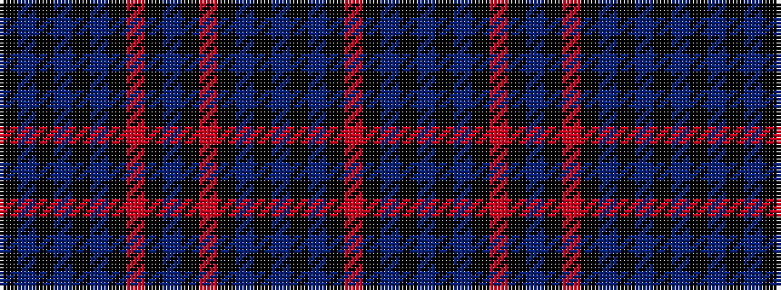

KBKBKBKRKBKRKBKBKBKR

It is a 20 stripe tartan.

<figure class="pat-woven">

<figcaption>idealised sample</figcaption>
</figure>

## Colour Sequence



## Tartans with this colour sequence

| Tartans |
|---------------|
| [Evans of Wales](/setts/s20/k3dt30k2dt4k2dt30k36r30k2t2k2r30k36dt30k2dt4k2dt30k3r2/)|
||
