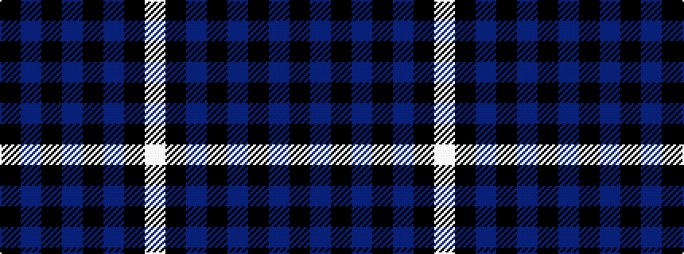

KBKBKBKW

It is a 8 stripe tartan.

<figure class="pat-woven">

<figcaption>idealised sample</figcaption>
</figure>

## Colour Sequence



## Tartans with this colour sequence

| Tartans |
|---------------|
| [Highland Spirit](/variants/s8/k21dp15k5dp15k5dp15k21w2~x2/)|
||
| [Slanj Dress (Corporate)](/variants/s8/k4db36k4db4k34b3k3w4~x2/)|
||
