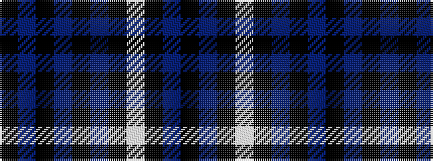

KBKBKBKWKBK

It is a 11 stripe tartan.

<figure class="pat-woven">

<figcaption>idealised sample</figcaption>
</figure>

## Colour Sequence



## Tartans with this colour sequence

| Tartans |
|---------------|
| [Scottish Jewish Community](/setts/s11/k14t3k3w4k3t3k14db4k4db30k4~x2/)|
||
