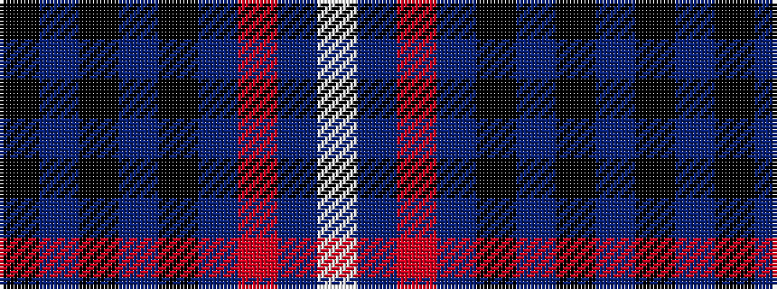

KBKBKBRBW

It is a 9 stripe tartan.

<figure class="pat-woven">

<figcaption>idealised sample</figcaption>
</figure>

## Colour Sequence



## Tartans with this colour sequence

| Tartans |
|---------------|
| [Broz Sanz Elementary (Corporate)](/setts/s9/k4db1k1db1k1db4r2db4w2~x4/)|
||
