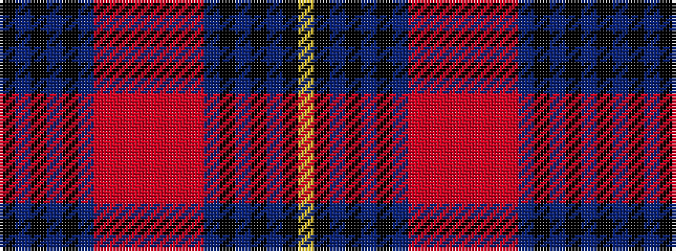

KBKBKBRRRRRRRBKBKBKY

It is a 20 stripe tartan.

<figure class="pat-woven">

<figcaption>idealised sample</figcaption>
</figure>

## Colour Sequence



## Tartans with this colour sequence

| Tartans |
|---------------|
| [Dryburgh Clan Tartan Tartan Number: 6422. Earliest known date: 2004 Based on Kerr, and the colours of the Dryburgh coat of arms including the 3 martlet birds, matriculated for William J. Dryburgh. See products available Copyright © Blair Urquhart, Comrie, 2015](/setts/s20/k10n2k2n2k3n10o16o2o2o2o2o2o16n10k3n2k2n2k10ly2~x2/)|
||
