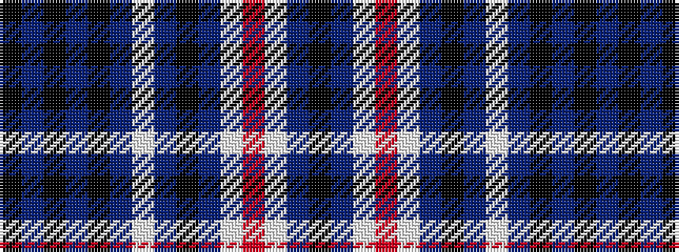

KBKBKBWBKBWRWBK

It is a 15 stripe tartan.

<figure class="pat-woven">

<figcaption>idealised sample</figcaption>
</figure>

## Colour Sequence



## Tartans with this colour sequence

| Tartans |
|---------------|
| [Beck Dress (Personal)](/variants/s15/k4t2w15r6w25t2k4t2w15t4k2t4k2t4k2~x2/)|
||
