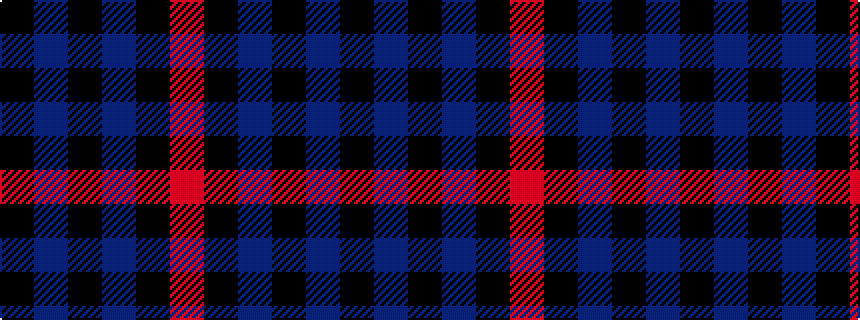

KBKBKR

It is a 6 stripe tartan.

<figure class="pat-woven">

<figcaption>idealised sample</figcaption>
</figure>

## Colour Sequence



## Tartans with this colour sequence

| Tartans |
|---------------|
| [Allen, Nicholas (Personal)](/variants/s6/r8k24db10k5db10k5~x2/)|
||
| [Slanj (Corporate)](/variants/s6/m4k28b3k3b25k3~x2/)|
||
