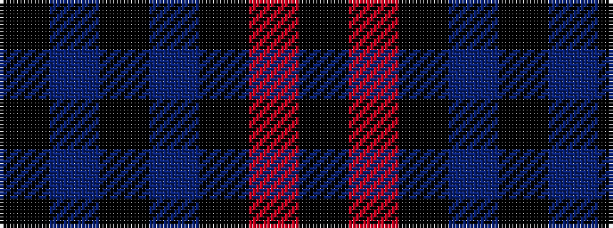

KBKBKRK

It is a 7 stripe tartan.

<figure class="pat-woven">

<figcaption>idealised sample</figcaption>
</figure>

## Colour Sequence



## Tartans with this colour sequence

| Tartans |
|---------------|
| [Gibson, Robert (Personal)](/variants/s7/k5db15k5b1k35m1k2~x4/)|
||
