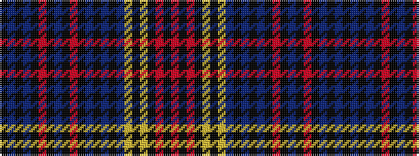

KBKBKRKBKRKBKBKBYKYKRKR

It is a 23 stripe tartan.

<figure class="pat-woven">

<figcaption>idealised sample</figcaption>
</figure>

## Colour Sequence



## Tartans with this colour sequence

| Tartans |
|---------------|
| [Zibrant](/setts/s23/k8n1k3n1k8ri9k6n4k6ri9k8n1k3n1k8n13lo1k13ly5k3r5k3r5~x2/)|
||
