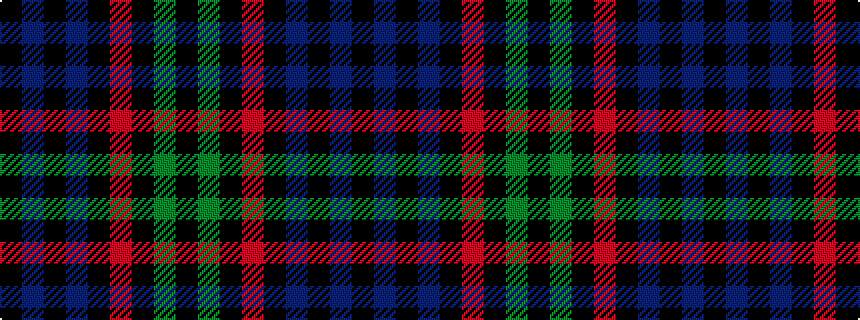

KBKBKRKGK

It is a 9 stripe tartan.

<figure class="pat-woven">

<figcaption>idealised sample</figcaption>
</figure>

## Colour Sequence



## Tartans with this colour sequence

| Tartans |
|---------------|
| [Swallow Hotels (Corporate)](/variants/s9/k4g21k10r2k10db21k4db4k4~x2/)|
||
