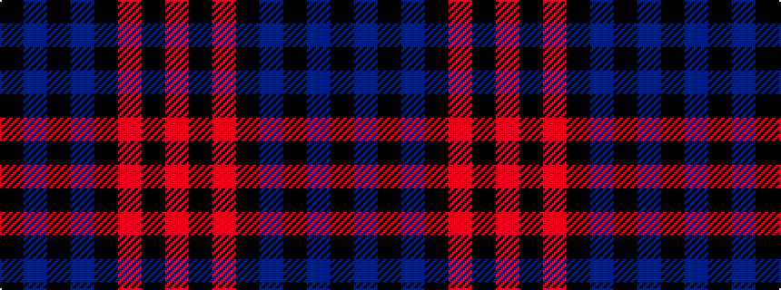

KBKBKRKR

It is a 8 stripe tartan.

<figure class="pat-woven">

<figcaption>idealised sample</figcaption>
</figure>

## Colour Sequence



## Tartans with this colour sequence

| Tartans |
|---------------|
| [Laird Abdullah (Personal)](/variants/s8/k10n2k2n8k40r4k5ri2~x2/)|
||
