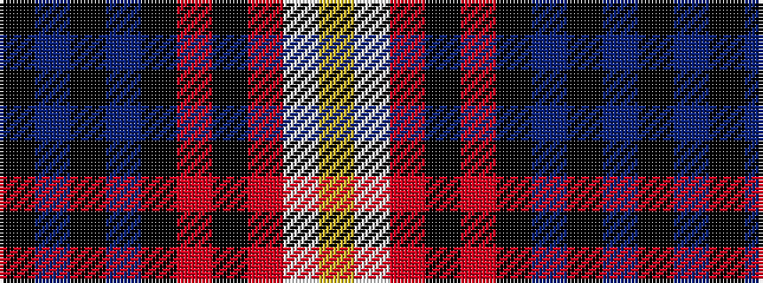

KBKBKRKRWY

It is a 10 stripe tartan.

<figure class="pat-woven">

<figcaption>idealised sample</figcaption>
</figure>

## Colour Sequence



## Tartans with this colour sequence

| Tartans |
|---------------|
| [Huntley Fire Protection District](/setts/s10/k11dt14k4dt14k12r13k3r3w2ly2~x2/)|
||
| [Huntly Fire Protection District (Cor](/setts/s10/k11db14k4db14k12r13k3r3w2ly2~x2/)|
||
