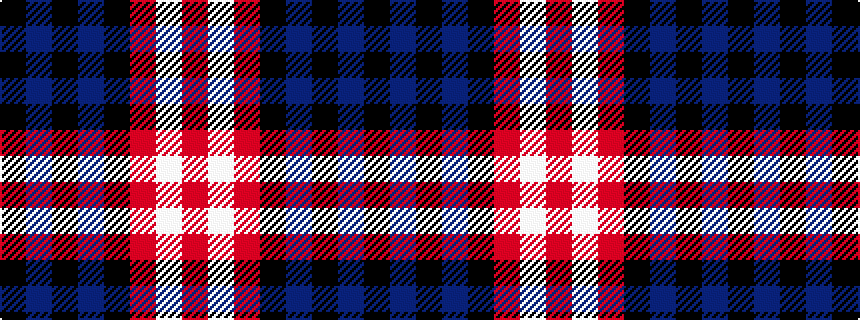

KBKBKRWR

It is a 8 stripe tartan.

<figure class="pat-woven">

<figcaption>idealised sample</figcaption>
</figure>

## Colour Sequence



## Tartans with this colour sequence

| Tartans |
|---------------|
| [Ostermeier (2015)](/variants/s8/r11w1r32k8db6k1db16k1~x2/)|
||
