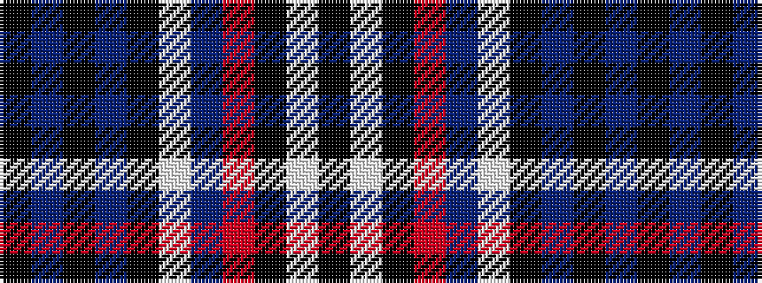

KBKBKWBRKWK

It is a 11 stripe tartan.

<figure class="pat-woven">

<figcaption>idealised sample</figcaption>
</figure>

## Colour Sequence



## Tartans with this colour sequence

| Tartans |
|---------------|
| [Springbank](/setts/s11/k14n2k2n5k25w1n9m3k3w1k14~x2/)|
||
