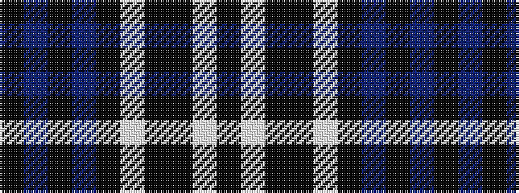

KBKBKWKKWK

It is a 10 stripe tartan.

<figure class="pat-woven">

<figcaption>idealised sample</figcaption>
</figure>

## Colour Sequence



## Tartans with this colour sequence

| Tartans |
|---------------|
| [Scottish Claymores](/setts/s10/k9w2k24k8w5k8db15k3db15k2~x2/)|
||
