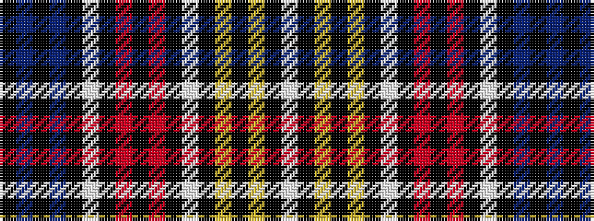

KBKBKWKRKRKWKYKYKW

It is a 18 stripe tartan.

<figure class="pat-woven">

<figcaption>idealised sample</figcaption>
</figure>

## Colour Sequence



## Tartans with this colour sequence

| Tartans |
|---------------|
| [Children In Need (Corporate)](/variants/s18/k5t5k1t5k5w1k5r5k1r5k5w1k5lo5k1lo5k5w1~x8/)|
||
