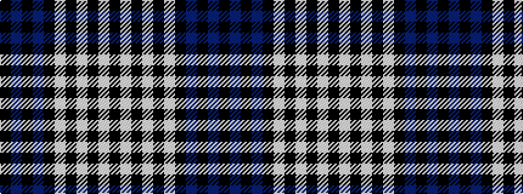

KBKBKWKWKWK

It is a 11 stripe tartan.

<figure class="pat-woven">

<figcaption>idealised sample</figcaption>
</figure>

## Colour Sequence



## Tartans with this colour sequence

This pattern is a design lineage: every tartan below shares one colour order, whatever its owner —
near-identical designs are grouped, the largest lineage first (#112: the pattern is a tartan's
second parent, beside its family or clan).

<table class="sett-table">
<tbody>
<tr><td><a href="/variants/s11/k14lb3k3w4k3lb3k14db4k4db30k4~x2/">Scottish Jewish Community</a></td></tr>
<tr><td class="sett-swatch"></td></tr>
<tr><td><a href="/setts/k15lb3k3w4k3lb3k15db4k4db30k4/">Shalom</a></td></tr>
<tr><td class="sett-swatch"></td></tr>
<tr class="cluster-sep"><td></td></tr>
<tr><td><a href="/variants/s11/k14w4k14w19k4w4k4n4k16n11k8/">Royal Stuart / Stewart</a></td></tr>
<tr><td class="sett-swatch"></td></tr>
</tbody>
</table>

