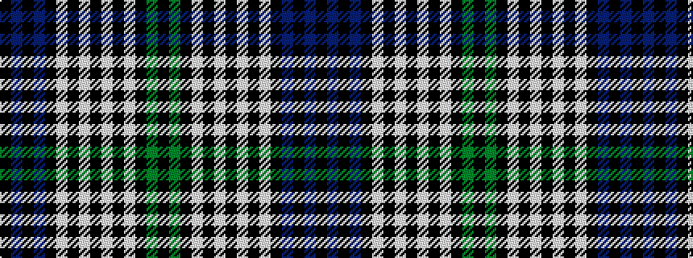

KBKBKWKWKWKWKGK

It is a 15 stripe tartan.

<figure class="pat-woven">

<figcaption>idealised sample</figcaption>
</figure>

## Colour Sequence



## Tartans with this colour sequence

| Tartans |
|---------------|
| [Fair Trade](/variants/s15/k8b2k2b24k8w2k1w2k4w2k1w2k8g16k4~x2/)|
||
