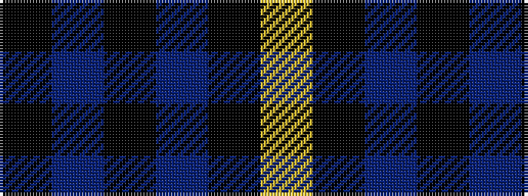

KBKBKY

It is a 6 stripe tartan.

<figure class="pat-woven">

<figcaption>idealised sample</figcaption>
</figure>

## Colour Sequence



## Tartans with this colour sequence

| Tartans |
|---------------|
| [Pride of the Forth](/setts/s6/k3n23k3n3k20lg3~x2/)|
||
| [Scottish National Party (Corporate)](/setts/s6/k3n31k3n3k27ly3~x2/)|
||
