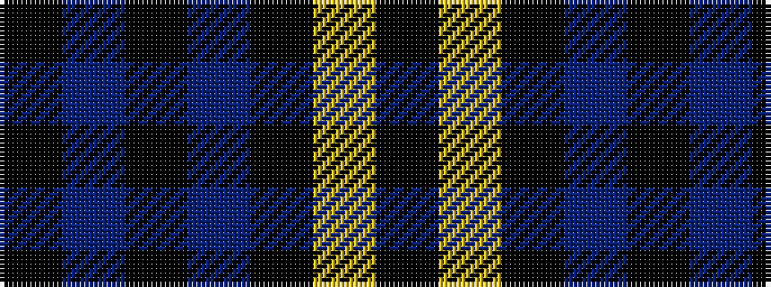

KBKBKYK

It is a 7 stripe tartan.

<figure class="pat-woven">

<figcaption>idealised sample</figcaption>
</figure>

## Colour Sequence



## Tartans with this colour sequence

| Tartans |
|---------------|
| [Carrick High School](/variants/s7/k6lo2k16t6k3db18k2~x2/)|
||
