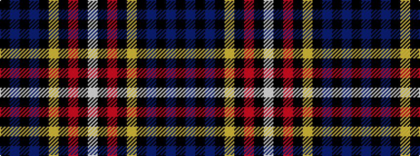

KBKBKYKRKW

It is a 10 stripe tartan.

<figure class="pat-woven">

<figcaption>idealised sample</figcaption>
</figure>

## Colour Sequence



## Tartans with this colour sequence

| Tartans |
|---------------|
| [Model T Ford (Corporate)](/variants/s10/k4dt16k3dt3k32lo7k3r10k2w4~x2/)|
||
