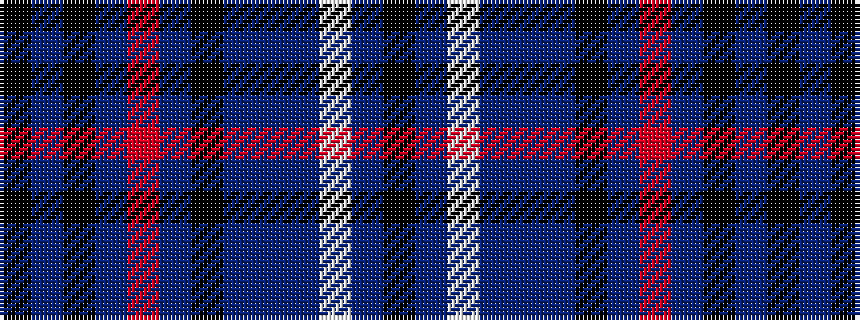

KBKBRBKBBBWBK

It is a 13 stripe tartan.

<figure class="pat-woven">

<figcaption>idealised sample</figcaption>
</figure>

## Colour Sequence



## Tartans with this colour sequence

| Tartans |
|---------------|
| [Pride of Norway (Fashion)](/setts/s13/k7db2k6db18r3db18k4dbi2db2dbi2w2dbi4k4~x2/)|
||
