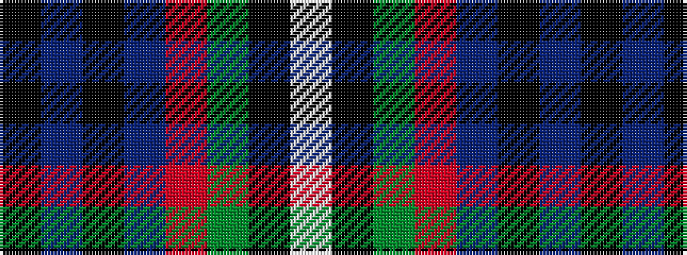

KBKBRGKW

It is a 8 stripe tartan.

<figure class="pat-woven">

<figcaption>idealised sample</figcaption>
</figure>

## Colour Sequence



## Tartans with this colour sequence

| Tartans |
|---------------|
| [MacKean Green (Personal)](/setts/s8/k4db8k4db8r2g10k1w2~x2/)|
||
