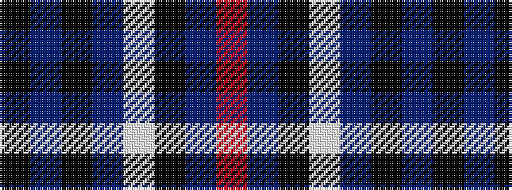

KBKBWKBR

It is a 8 stripe tartan.

<figure class="pat-woven">

<figcaption>idealised sample</figcaption>
</figure>

## Colour Sequence



## Tartans with this colour sequence

| Tartans |
|---------------|
| [Lexington Fire Department](/setts/s8/k8db8k2db2w2k5db5r2~x5/)|
||
