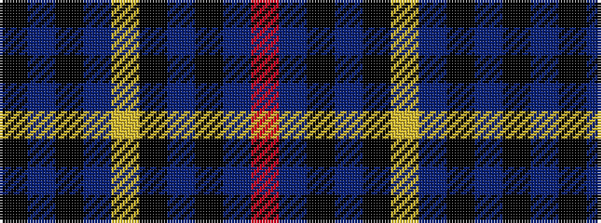

KBKBYKBKBR

It is a 10 stripe tartan.

<figure class="pat-woven">

<figcaption>idealised sample</figcaption>
</figure>

## Colour Sequence



## Tartans with this colour sequence

| Tartans |
|---------------|
| [MacArthur Fox Green (Personal)](/setts/s10/r4dt4k2dt31k10ly3dt5k11dt6k3~x2/)|
||
