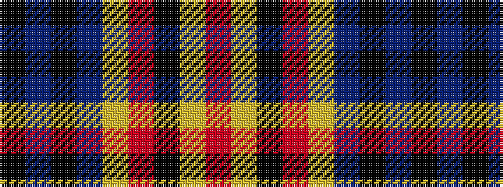

KBKBYRKYR

It is a 9 stripe tartan.

<figure class="pat-woven">

<figcaption>idealised sample</figcaption>
</figure>

## Colour Sequence



## Tartans with this colour sequence

| Tartans |
|---------------|
| [Craigholme (Corporate)](/setts/s9/k24db2k24db14ly3r36k18ly5r3~x2/)|
||
