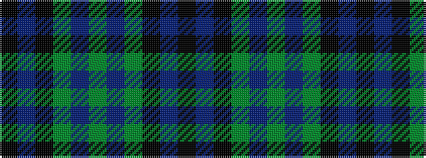

KBKGBGBGKBK

It is a 11 stripe tartan.

<figure class="pat-woven">

<figcaption>idealised sample</figcaption>
</figure>

## Colour Sequence



## Tartans with this colour sequence

| Tartans |
|---------------|
| [Graham](/setts/s11/k2db12k12g1t2g16t2g1k12db12k1~x4/)|
||
