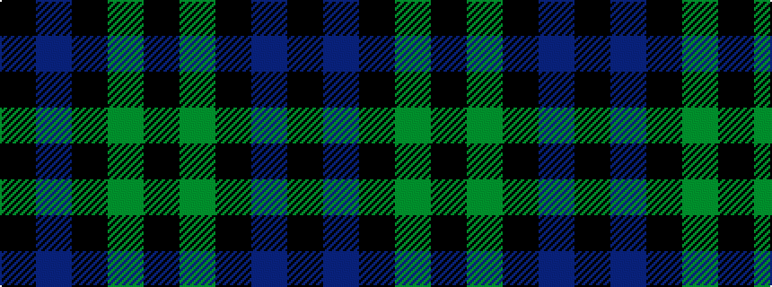

KBKGK

It is a 5 stripe tartan.

<figure class="pat-woven">

<figcaption>idealised sample</figcaption>
</figure>

## Colour Sequence



## Tartans with this colour sequence

| Tartans |
|---------------|
| [Campbell of Loch Awe](/variants/s5/k2g11k26b11k2~x2/)|
||
| [Campbell of Lochawe](/variants/s5/k2db11k26g11k2~x2/)|
||
