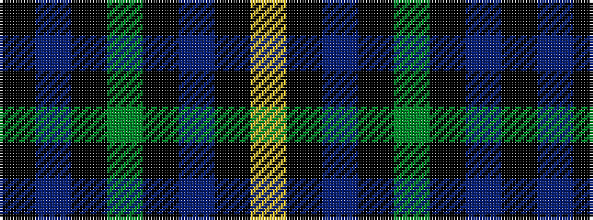

KBKGKBKY

It is a 8 stripe tartan.

<figure class="pat-woven">

<figcaption>idealised sample</figcaption>
</figure>

## Colour Sequence



## Tartans with this colour sequence

| Tartans |
|---------------|
| [U.S. Border Patrol](/setts/s8/k10b10k15g40k15b10k10ly3~x2/)|
||
