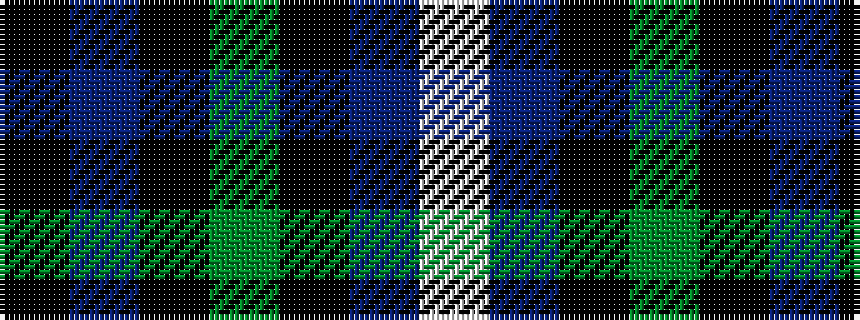

KBKGKBW

It is a 7 stripe tartan.

<figure class="pat-woven">

<figcaption>idealised sample</figcaption>
</figure>

## Colour Sequence



## Tartans with this colour sequence

| Tartans |
|---------------|
| [Marchmont](/setts/s7/k1db12k12g1k12db12w1~x4/)|
||
