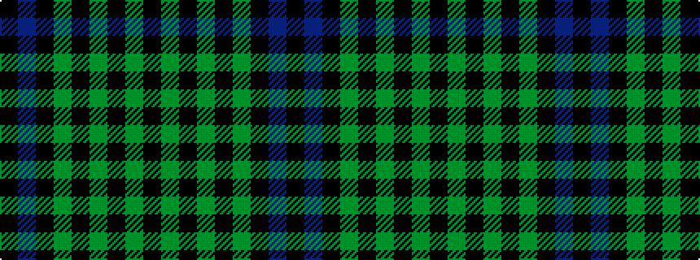

KBKGKGKGK

It is a 9 stripe tartan.

<figure class="pat-woven">

<figcaption>idealised sample</figcaption>
</figure>

## Colour Sequence



## Tartans with this colour sequence

| Tartans |
|---------------|
| [GOLF (Wonderland Publications) Corporate Tartan](/variants/s9/k10p3k6g1k6g1k6g2k6~x2/)|
||
