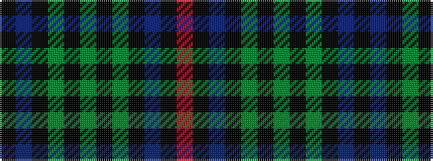

KBKGKGKGKBKR

It is a 12 stripe tartan.

<figure class="pat-woven">

<figcaption>idealised sample</figcaption>
</figure>

## Colour Sequence



## Tartans with this colour sequence

| Tartans |
|---------------|
| [Wilson's No.230](/setts/s12/r4k2db16k17dg16k2y4~x2/)|
||
