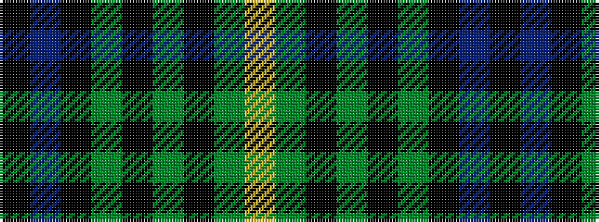

KBKGKGKGY

It is a 9 stripe tartan.

<figure class="pat-woven">

<figcaption>idealised sample</figcaption>
</figure>

## Colour Sequence



## Tartans with this colour sequence

| Tartans |
|---------------|
| [Martin](/variants/s9/lo4g10k3g3k3g3k9dr11k3~x4/)|
||
