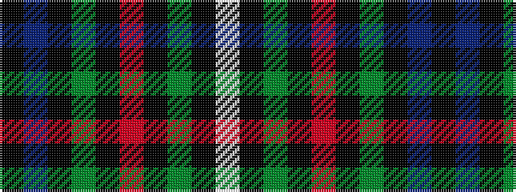

KBKGKRKGKW

It is a 10 stripe tartan.

<figure class="pat-woven">

<figcaption>idealised sample</figcaption>
</figure>

## Colour Sequence



## Tartans with this colour sequence

| Tartans |
|---------------|
| [Mount Dora](/setts/s10/k42dp4k16dg10ki2r6ki2dg10ki3w4~x2/)|
||
