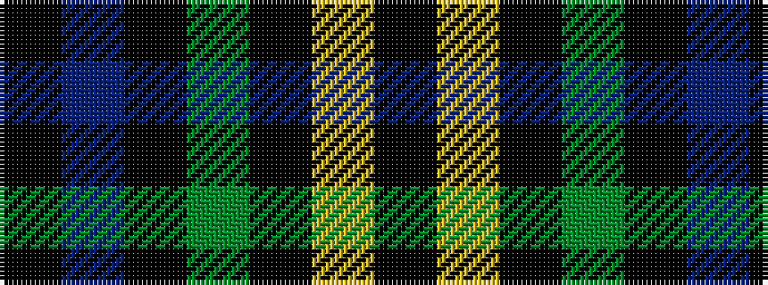

KBKGKYK

It is a 7 stripe tartan.

<figure class="pat-woven">

<figcaption>idealised sample</figcaption>
</figure>

## Colour Sequence



## Tartans with this colour sequence

| Tartans |
|---------------|
| [London Community Gospel Choir](/setts/s7/k25ly5k5g25k25b3k10~x2/)|
||
| [London Community Gospel Choir, The](/setts/s7/k25lo5k5dg25k25db3k10~x2/)|
||
