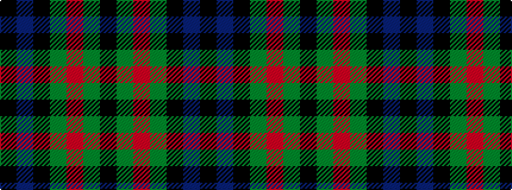

KBKGRGK

It is a 7 stripe tartan.

<figure class="pat-woven">

<figcaption>idealised sample</figcaption>
</figure>

## Colour Sequence



## Tartans with this colour sequence

| Tartans |
|---------------|
| [Dundas](/variants/s7/k4db16k12dg24r1dg2k2~x2/)|
||
| [Dundas #2](/variants/s7/k4db16k12g12r1g2k2~x2/)|
||
| [Dundas Clan Tartan](/variants/s7/k4db16k12g24r1g2k2~x2/)|
||
| [MacCallum](/variants/s7/k6g6r1g6k6db6k1~x2/)|
||
| [MacCallum #2](/variants/s7/k6dg6r1dg6k6db6k1~x2/)|
||
