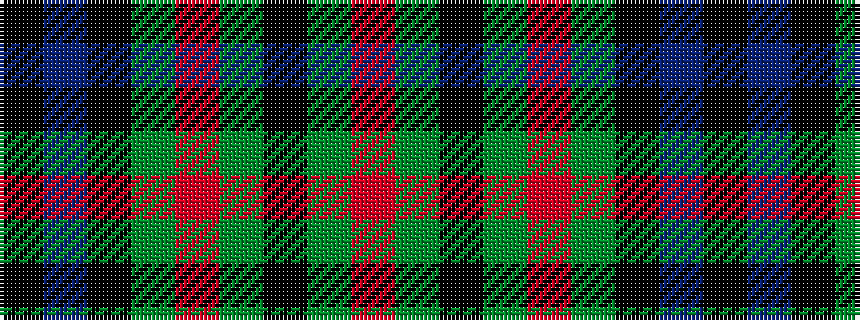

KBKGRGKGR

It is a 9 stripe tartan.

<figure class="pat-woven">

<figcaption>idealised sample</figcaption>
</figure>

## Colour Sequence



## Tartans with this colour sequence

| Tartans |
|---------------|
| [Unidentified No 30](/setts/s9/k1db3k3dg3r1dg3k3dg1r1~x2/)|
||
| [Unnamed, No 30](/setts/s9/k1db3k3g3r1g3k3g1r1~x2/)|
||
