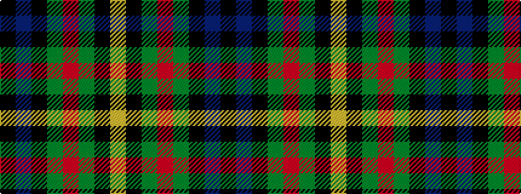

KBKGRGKY

It is a 8 stripe tartan.

<figure class="pat-woven">

<figcaption>idealised sample</figcaption>
</figure>

## Colour Sequence



## Tartans with this colour sequence

| Tartans |
|---------------|
| [MacLeish](/variants/s8/k18db12k5g4r6g12k2lo4~x2/)|
||
