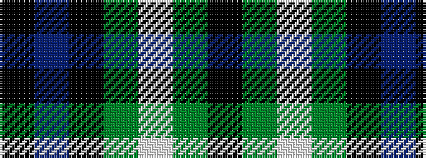

KBKGWGK

It is a 7 stripe tartan.

<figure class="pat-woven">

<figcaption>idealised sample</figcaption>
</figure>

## Colour Sequence



## Tartans with this colour sequence

This pattern is a design lineage: every tartan below shares one colour order, whatever its owner —
near-identical designs are grouped, the largest lineage first (#112: the pattern is a tartan's
second parent, beside its family or clan).

<table class="sett-table">
<tbody>
<tr><td><a href="/setts/k4g4w1g4k4db4k1/">Graham of Montrose</a></td></tr>
<tr><td class="sett-swatch"></td></tr>
<tr><td><a href="/variants/s7/k9g9w2g9k9db9k3~x2/">Graham of Montrose - 1850 (Clan)</a></td></tr>
<tr><td class="sett-swatch"></td></tr>
<tr><td><a href="/variants/s7/k13g12lb2g12k13dp12k2~x2/">MacLaggan</a></td></tr>
<tr><td class="sett-swatch"></td></tr>
<tr><td><a href="/variants/s7/k7g6w1g6k7db7k1~x4/">MacLaggan Artifact Tartan</a></td></tr>
<tr><td class="sett-swatch"></td></tr>
<tr><td><a href="/variants/s7/k6g6w1g6k6dp6k1~x4/">Wilson's, No 64 or Abercrombie</a></td></tr>
<tr><td class="sett-swatch"></td></tr>
</tbody>
</table>

