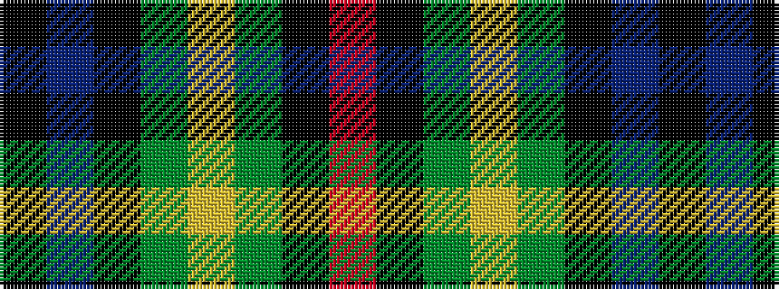

KBKGYGKR

It is a 8 stripe tartan.

<figure class="pat-woven">

<figcaption>idealised sample</figcaption>
</figure>

## Colour Sequence



## Tartans with this colour sequence

| Tartans |
|---------------|
| [Aztec, New Mexico](/variants/s8/r3k8g17ly2g17k8b8k2~x2/)|
||
