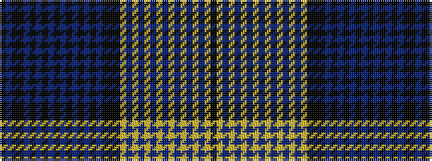

KBKKBKBKBKBKBKBKBKKKYBYBYBYBYBYBYBYK

It is a 36 stripe tartan.

<figure class="pat-woven">

<figcaption>idealised sample</figcaption>
</figure>

## Colour Sequence



## Tartans with this colour sequence

| Tartans |
|---------------|
| [Manitoba (Commemorative)](/variants/s36/k50db16k8ki8db1ki1db1ki1db1ki1db1ki1db1ki1db1ki1db20ki40k12ki24lo8db1lo1db1lo1db1lo1db1lo1db1lo1db1lo1db28lo6ki4/)|
||
