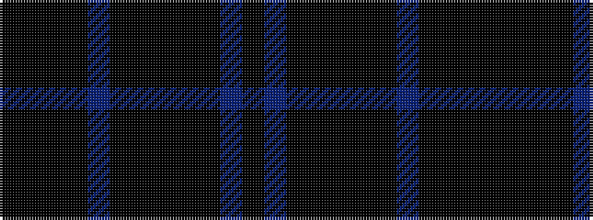

KBKKKKKBKKKK

It is a 12 stripe tartan.

<figure class="pat-woven">

<figcaption>idealised sample</figcaption>
</figure>

## Colour Sequence



## Tartans with this colour sequence

| Tartans |
|---------------|
| [Warwick (Fashion)](/setts/s12/k8dp2k7k2k2k2k2n8k6k2k3k2~x2/)|
||
