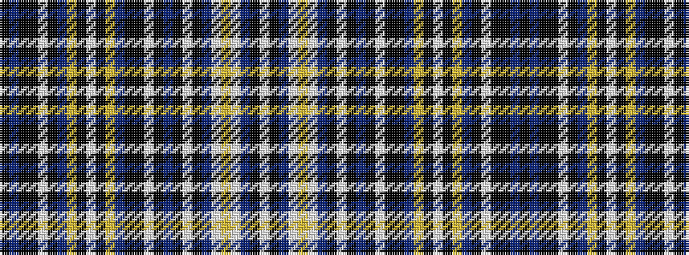

KBKKWKBYKWKYBKKWKBKWKBWYWBKW

It is a 28 stripe tartan.

<figure class="pat-woven">

<figcaption>idealised sample</figcaption>
</figure>

## Colour Sequence



## Tartans with this colour sequence

| Tartans |
|---------------|
| [MacPerl Dress (Personal)](/setts/s28/k1db5k18ki8w1k18db5ly3k1w3k1ly3db5k18ki8w1k18db5k1w1k1db3w1ly3w1db3k1w1~x2/)|
||
