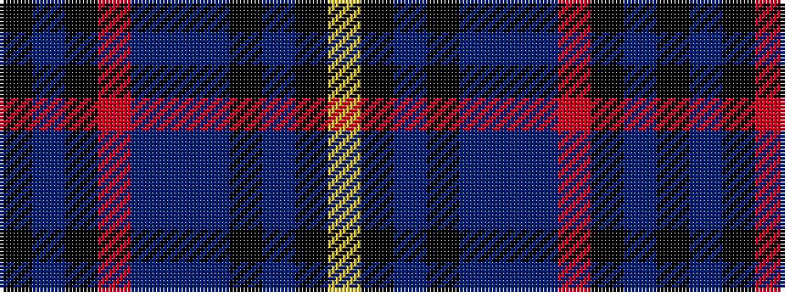

KBKRBBBKBKY

It is a 11 stripe tartan.

<figure class="pat-woven">

<figcaption>idealised sample</figcaption>
</figure>

## Colour Sequence



## Tartans with this colour sequence

| Tartans |
|---------------|
| [Australia 2000](/setts/s11/k3t6k4r6t18db53t18k8t6k3lo2~x2/)|
||
