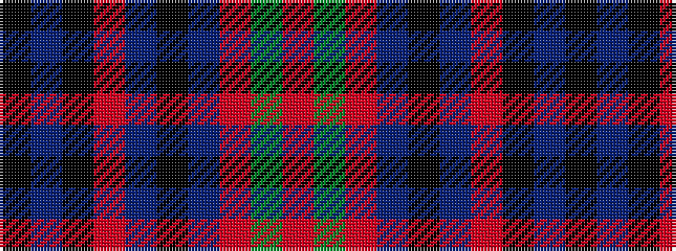

KBKRBKBRGR

It is a 10 stripe tartan.

<figure class="pat-woven">

<figcaption>idealised sample</figcaption>
</figure>

## Colour Sequence



## Tartans with this colour sequence

| Tartans |
|---------------|
| [Scoepaig, fragment](/setts/s10/k10t1k1r10t1k1t1r10g6r2~x2/)|
||
