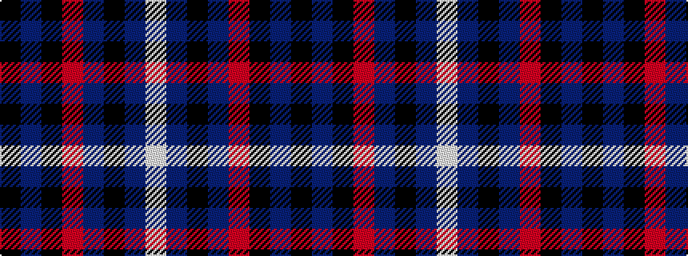

KBKRBKBW

It is a 8 stripe tartan.

<figure class="pat-woven">

<figcaption>idealised sample</figcaption>
</figure>

## Colour Sequence



## Tartans with this colour sequence

| Tartans |
|---------------|
| [Inverness Caledonian Thistle Football Club](/variants/s8/k21db3k12r2db12k2db12w2~x2/)|
||
