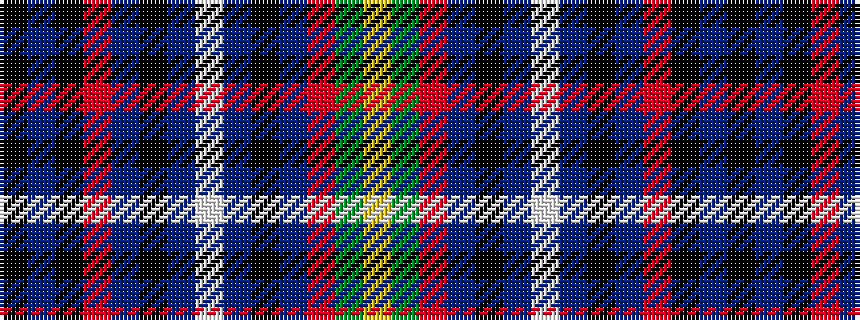

KBKRBKBWBKBRGY

It is a 14 stripe tartan.

<figure class="pat-woven">

<figcaption>idealised sample</figcaption>
</figure>

## Colour Sequence



## Tartans with this colour sequence

| Tartans |
|---------------|
| [MacLellan/McLellan Hunting (Personal)](/variants/s14/k2db7k5r2db5k2db5w1db5k1db5r2dg7ly2~x4/)|
||
