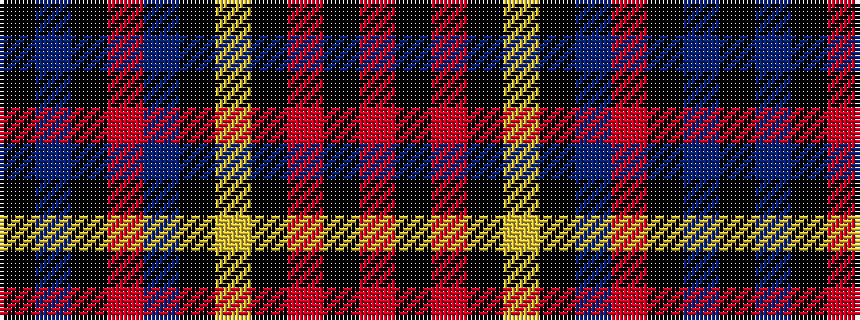

KBKRBKYKRKR

It is a 11 stripe tartan.

<figure class="pat-woven">

<figcaption>idealised sample</figcaption>
</figure>

## Colour Sequence



## Tartans with this colour sequence

| Tartans |
|---------------|
| [Glennie, The Rhythms of Evelyn](/variants/s11/r25k4r2k3ly2k2db3r2k3db2k2~x2/)|
||
